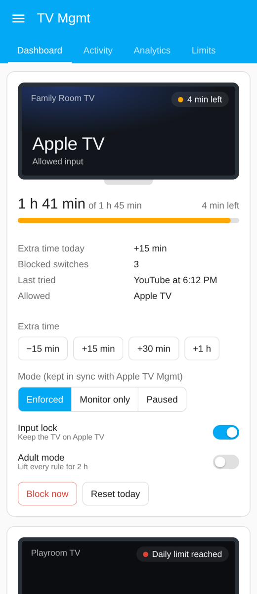
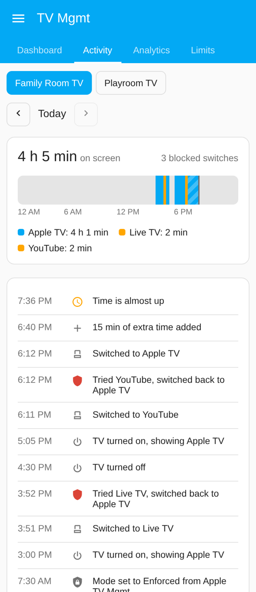
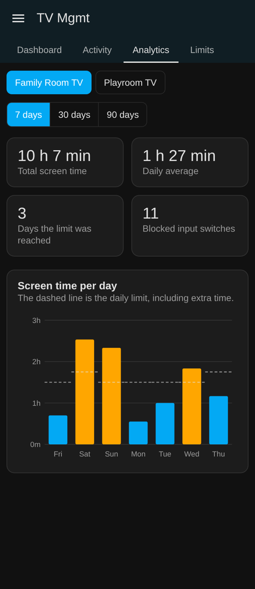
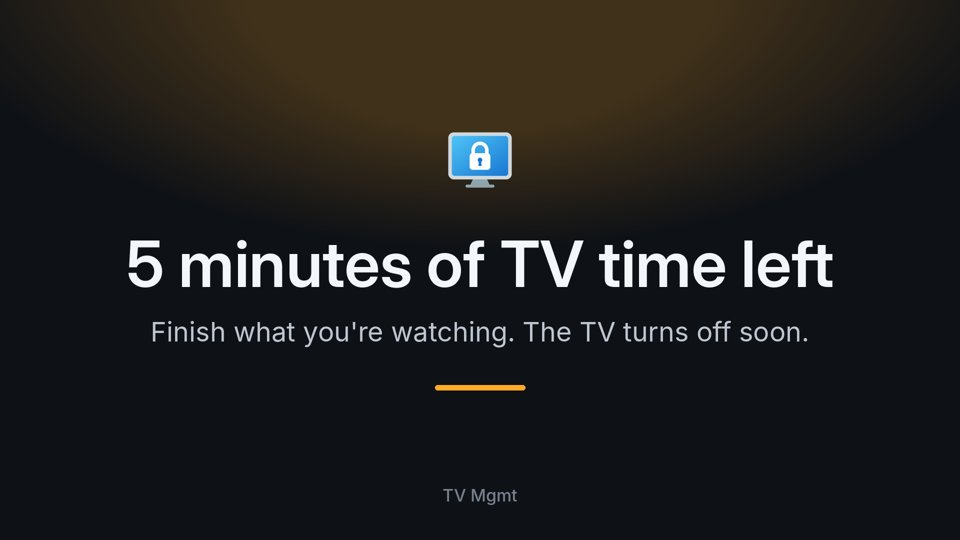
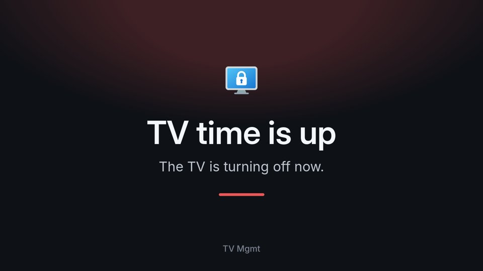

# TV Mgmt

[](https://hacs.xyz/)
[](https://www.home-assistant.io/)
[](https://github.com/bisman-automations/ha-tv-mgmt/releases)
[](https://github.com/bisman-automations/ha-tv-mgmt/actions/workflows/validate.yml)

> Parental controls for smart TVs in Home Assistant. Lock a TV to **one input** (say, the Apple TV), give it a **daily screen-time limit**, and keep it **off at bedtime**.

Smart TVs have no real way to say "only the Apple TV." Kids flip to the built-in YouTube app, or to another HDMI input, and any controls on the Apple TV don't apply. TV Mgmt watches the TV through the integration that already runs it in Home Assistant, and it:

- **Locks the input.** If the TV switches to anything but the allowed input, it's switched straight back.
- **Limits screen time.** It counts how long the TV is on each day. When the limit is reached, the TV is turned off, and it stays off if someone turns it back on.
- **Keeps quiet windows.** The TV stays off during bedtime, school hours, or whatever windows you set.
- **Manages the Apple TV too.** Link the Apple TV plugged into the TV to see time per app, block apps (or allow only a few), and give apps their own daily limits.
- **Leaves parents in charge.** You can grant extra time, block now, pause the rules, or use **adult mode** to lift everything for a movie night.

It's modeled on [Apple TV Mgmt](https://github.com/jarvis2k1/ha-appletv-mgmt), but it controls the TV itself, so it works whatever is plugged into it.

```
┌──────────────────┐  state changes   ┌──────────────┐  select_source / remote keys
│ TV media_player  │ ───────────────▶ │   tv_mgmt    │ ────────────────────────────▶  back to allowed input
│ (webOS, Roku,    │  source, on/off  │  (profile)   │  media_player.turn_off
│  Android TV, …)  │                  └──────────────┘ ────────────────────────────▶  TV off when blocked
└──────────────────┘
```

## Install

### 1. Install with HACS

[](https://my.home-assistant.io/redirect/hacs_repository/?owner=bisman-automations&repository=ha-tv-mgmt&category=integration)

1. Click the button above, or in HACS open the menu, choose **Custom repositories**, and add `https://github.com/bisman-automations/ha-tv-mgmt` as an **Integration**.
2. Download **TV Mgmt** and restart Home Assistant.

Requires **Home Assistant 2026.3 or newer**.

<details>
<summary>Manual install (no HACS)</summary>

Copy `custom_components/tv_mgmt/` into your `config/custom_components/` folder and restart Home Assistant.
</details>

### 2. Add a profile for each TV

[](https://my.home-assistant.io/redirect/config_flow_start/?domain=tv_mgmt)

Or go to **Settings → Devices & services → Add integration → TV Mgmt**.

1. Pick the TV's `media_player` entity. The TV needs to be set up in Home Assistant already.
2. Turn the TV on and switch it to the input you want to allow. It's preselected for you.
3. Optionally set a daily limit and quiet windows.

You can change everything later with **Configure**. Each TV gets its own profile, rules and entities.

## Supported TVs

TV Mgmt works through the integration that already controls your TV.

| Integration | Sees current input | Switches input | Notes |
| --- | --- | --- | --- |
| LG webOS | ✅ | ✅ | Uses your input names (e.g. "Apple TV") |
| Roku | ✅ | ✅ | Inputs appear alongside channels |
| SmartThings (Samsung) | ✅ | ✅ | Best option for Samsung TVs |
| Sony Bravia, Vizio, and others with `source` + `select_source` | ✅ | ✅ | Generic support |
| Android TV Remote | ✅ (as app) | ✅ HDMI keycodes via its `remote` entity | See below |
| Android TV (ADB) | ✅ (as app) | ✅ HDMI keyevents via `adb_command` | See below |
| Samsung Smart TV (`samsungtv`) | ❌ | ✅ `KEY_HDMIn` via its `remote` entity | Input forced at power-on only |

Screen-time limits and quiet windows work on any TV Home Assistant can turn off.

**Android TV / Google TV.** These integrations report the foreground app, not the HDMI port. Each TV maker shows HDMI inputs as its own app package, so switch to the allowed input before setup and its package will be listed. Pick an **HDMI number** as the input to force back to. On some TVs every HDMI port shares one package. Those TVs still block apps like YouTube or Netflix, but can't tell HDMI 1 from HDMI 2.

**Samsung.** The `samsungtv` integration can't tell which input is on screen, so it can only force the input when the TV turns on. For a full lock, add the TV through SmartThings and use that entity instead.

## Sidebar app

TV Mgmt adds a **TV Mgmt** entry to the Home Assistant sidebar for admins, and for any parents you give access to (see [Who can use TV Mgmt](#who-can-use-tv-mgmt)). It needs no add-on or extra setup, and works in the browser and the Companion app.

<p>



</p>

*Screenshots use sample data.*

- **Dashboard.** Every TV at a glance. On a wide screen each TV spreads out into columns, with the TV, the Apple TV and the controls side by side. On a phone they stack.
  - what it's showing, and whether that's allowed
  - time used and time left
  - extra time, blocked switches and the last input someone tried
  - controls to add or take away time (15, 30 or 60 minutes, or any number you type), block now, change the mode, and turn the input lock or adult mode on and off
  - a remote for the TV: power, volume and mute, and a **Remote** button that opens arrow keys, OK, Back and Home
  - links to the TV, the Apple TV and every TV Mgmt entity. Each opens Home Assistant's usual entity dialog, with its history and settings.
- **Activity.** A 24-hour strip of when the TV was on and on which input, with inputs that aren't allowed in a warning colour. Underneath is a log of what happened: switches, blocks, limits reached, extra time, mode changes. Step back through past days.
- **Analytics.** Screen time per day against the daily limit over 7, 30 or 90 days, with totals, daily average, days the limit was reached, and blocked switches.
- **Limits.** Change the daily screen time, warning time, quiet windows and adult mode length. Saving applies them right away.

Remote buttons appear only when the TV's integration can press them:

| Integration | Power and volume | Arrow keys, OK, Back, Home |
| --- | --- | --- |
| Android TV Remote | ✓ | ✓ through its remote entity |
| Android TV (ADB) | ✓ | ✓ through `androidtv.adb_command` |
| LG webOS | ✓ | ✓ through `webostv.button` |
| Roku, Samsung, Sony Bravia | ✓ | ✓ through their remote entity |
| Other TVs | if the media player supports it | — |

The panel updates live as things change. Activity history starts when you install 1.2.0. TV Mgmt keeps 90 days of activity and about a year of daily totals.

## Who can use TV Mgmt

Admins can always use TV Mgmt. To let someone else in, such as a parent who isn't a Home Assistant admin, open the sidebar app's **Access** tab, check them, and save. Everyone else is turned away, kids included.

The same rule covers:

- the sidebar app: anyone not allowed sees a page saying they don't have access, with their user ID
- TV Mgmt's **Input lock** and **Adult mode** switches and **Mode** select, wherever they're used, such as on a regular dashboard
- the `tv_mgmt.*` actions

Automations and scripts that Home Assistant runs on its own aren't affected.

Only admins see TV Mgmt in the sidebar until you give access to someone who isn't an admin. Home Assistant can't show a sidebar entry to only some people, so from then on everyone sees it, and anyone not allowed gets the no-access page.

## Warnings on the TV

TV Mgmt can tell the room when TV time is running low, at the **Warn before time runs out** time, and again just before it turns the TV off. Set it up under **Configure → Warnings on the TV**. Use any of these:

- **Say it on speakers.** Pick a voice (a text-to-speech entity, such as Piper or Google Translate) and the media players to say it on, such as a HomePod. For example: "5 minutes of TV time left."
- **Show it on the Apple TV with AirPlay.** TV Mgmt plays a 10-second full-screen message on the linked Apple TV, if it's on. It interrupts what's playing; the warning says how many minutes are left.

   

  The Apple TV fetches the video from Home Assistant's local address, so set one under **Settings → System → Network**. The Apple TV integration needs AirPlay set up, which it does when you pair it.
- **Show it on the TV screen** with a notify service that puts messages on the TV, over any input. On Android TV and Google TV, use the [Notifications for Android TV / Fire TV](https://www.home-assistant.io/integrations/nfandroidtv/) integration and its app on the TV. LG webOS has one built in.

You can also send your own message from the dashboard: type it under **Message the TV**, or tap one like "Dinner is ready", and pick where it goes: the Apple TV, the TV screen or the speakers. It's also the `tv_mgmt.send_message` action, for automations. On the Apple TV, TV Mgmt turns the message into a 10-second video with ffmpeg, which Home Assistant includes.

When a warning is set up, TV Mgmt waits 10 seconds after the "turning off" message before it turns the TV off and puts the Apple TV to sleep, so it can be heard or read. Warnings don't play in monitor-only, paused or adult mode, or when the TV is off.

## Naming inputs

TVs report inputs however their integration knows them. Android TV, for example, reports the app on screen, so an HDMI input can show up as `com.tcl.tv`. Give it a name you'll recognise, like **Apple TV**, and TV Mgmt shows that name everywhere:

- the **Current input** sensor
- the sidebar app
- the settings dropdowns
- `tv_mgmt_input_blocked` events

TV Mgmt still matches on the real value, so the input lock isn't affected.

- **In the sidebar app:** **Limits → Input names** lists every input the TV has reported. Type a name next to any of them and save.
- **In settings:** **Configure → Input lock → Input names**, one per line:

  ```
  com.tcl.tv = Apple TV
  HDMI 2 = Apple TV
  ```

Common Android TV and Google TV apps already have readable names, such as YouTube, Netflix and Google TV home. Your names take priority.

## Apple TV apps

Link the Apple TV that's plugged into a TV, and the room gets one set of rules for both. It uses Home Assistant's [Apple TV integration](https://www.home-assistant.io/integrations/apple_tv/), so set that up first.

Open **Configure** on the TV's profile and pick the Apple TV under **Apple TV**. It's preselected if you have only one.

Then set **Apple TV is on input** to what the TV shows while it's on the Apple TV, such as `HDMI 2`, or on Android TV an app like `com.tcl.tv`. That ties the lock to the Apple TV:

- **Kids stay on the Apple TV.** That input is always allowed. If someone opens the TV's own YouTube app, Live TV or another input, the TV goes straight back to the Apple TV. On Android TV, set **Input lock → Input to force back to** to the Apple TV's HDMI number, because that's how the TV switches.
- **Waking the Apple TV brings the TV to it.** If HDMI-CEC hasn't switched the TV within a few seconds, TV Mgmt does it. This doesn't happen in monitor-only, paused or adult mode, or when the TV is off.

On top of that:

- **Time per app.** TV Mgmt records which app is open and for how long. The home screen doesn't count. It shows on two new sensors, **Current app** and **App time today**, and in the sidebar app's dashboard, activity and analytics.
- **Block apps, or allow only a few.** Either block the apps you check (say Roblox), or allow only the apps you check (say Disney+ and PBS KIDS Video) and block everything else.
- **Daily limits per app.** For example, YouTube 30 minutes. When an app hits its limit, it's stopped for the rest of the day.
- **What happens.** A stopped app sends the Apple TV back to its home screen, so other apps still work, or puts it to sleep if you prefer.
- **Wake with the TV.** Turning the TV on wakes the Apple TV, which brings the TV to its input. This doesn't happen while the TV is blocked, or in monitor-only, paused or adult mode.
- **Sleep with the TV.** When the TV is blocked (limit reached, quiet window, or Block now), the Apple TV is put to sleep too.
- **What's watched.** TV Mgmt records each show, episode, movie or song played on the Apple TV, and the app it's in, with time spent playing (paused time doesn't count). It appears in:
  - the dashboard, under **Watched today**
  - the activity log, as "Watching Bluey, Season 2, Episode 14: Hammerbarn in Disney+"
  - analytics, under **Top shows and movies**
  - attributes on the **Current app** sensor (`now_watching`, `show`) and the **App time today** sensor (`shows`, in minutes)

  This depends on the app telling the Apple TV what's playing. Most streaming apps do, but some don't, and then there's nothing to record.

App rules follow the TV's **Mode**:

- **Monitor only:** stopped apps are logged and reported, but nothing is closed.
- **Paused** and **Adult mode:** app rules are lifted.

On the sidebar app's dashboard, the Apple TV gets its own **Now playing** spot under the TV. It shows the artwork, title, show and episode, and app, with a live progress bar and buttons for play/pause, previous and next. Under it are **Sleep** (or **Wake**), volume, and a **Remote** with arrow keys, OK, **Menu** and **Home**, through the Apple TV's remote entity.

Edit app rules in the sidebar app under **Limits → Apple TV apps**: check apps and type a daily limit next to any of them. Or use **Configure → Apple TV**, with limits one per line:

```
YouTube = 30
Netflix = 60
```

Rules match the app's name or its ID, like `com.google.ios.youtube`. Going back to the home screen uses the Apple TV's `remote` entity. If there isn't one, TV Mgmt puts the Apple TV to sleep instead.

## Using it with Apple TV Mgmt

If [Apple TV Mgmt](https://github.com/jarvis2k1/ha-appletv-mgmt) manages the Apple TV plugged into this TV, link the two so their **Mode** stays the same. Under **Apple TV Mgmt → Keep mode in sync with**, pick that profile's **Mode** select. It's preselected when an Apple TV Mgmt profile uses this TV as its TV entity, or when you only have one.

- Changing the mode in either integration changes it in the other: enforced, monitor only, or paused.
- At startup, Apple TV Mgmt's mode wins if the two differ. If TV Mgmt's mode changed while Apple TV Mgmt was unavailable, TV Mgmt's mode is pushed once it's back.
- Leave the setting empty to keep them separate.

## What you get

Each profile is a device named like Apple TV Mgmt's, such as **TV Mgmt — Family Room TV**. It's linked to the TV's own device, and to the linked Apple TV's:

- **Home Assistant 2026.8 and newer:** TV Mgmt shows under **Linked devices** on the TV's and the Apple TV's device pages, and they show under TV Mgmt's, the same way a UniFi client shows next to the device it is.
- **Older versions:** TV Mgmt shows as connected via the TV, and the TV's and the Apple TV's device pages list TV Mgmt as an integration.

It has these entities:

| Entity | What it does |
| --- | --- |
| **Mode** (select) | `Enforced` acts on the rules. `Monitor only` tracks time and logs input switches without acting on them. `Paused` turns all rules off. |
| **Input lock** (switch) | Turns the one-input lock on or off. Screen-time rules still apply when it's off. |
| **Adult mode** (switch) | Lifts every rule for a set time (2 hours by default), then turns itself off. |
| **Enforcement state** (sensor) | `OK`, `Warning`, `Blocked`, `Paused` or `Adult mode`, with the reason and any active quiet window. |
| **Time used today** / **Time remaining today** (sensors) | Today's screen time. Remaining is unknown when there's no daily limit. |
| **Extra time today** (sensor) | Minutes granted (or taken) today. |
| **Current input** (sensor) | What the TV is showing, using your [input names](#naming-inputs), and whether it's allowed. Shows `TV off` when the TV is off. The `source` attribute has the value the TV reports. |
| **Blocked switches today** (sensor) | How many times someone tried another input, and the last one tried. |

Counters, extra time and manual blocks reset at midnight. Mode, input lock and adult mode survive restarts.

## Services

All services take the profile (`profile_id`) to act on.

| Service | What it does |
| --- | --- |
| `tv_mgmt.grant_extension` | Add minutes to today's limit (negative to take time away). |
| `tv_mgmt.force_block` | Turn the TV off and keep it off until unblocked or the day ends. |
| `tv_mgmt.unblock` | Lift a manual block. |
| `tv_mgmt.reset_usage` | Clear today's screen time, extra time and manual block. |
| `tv_mgmt.send_message` | Send a message to the TV: full screen on the Apple TV with AirPlay (`apple_tv`), on the TV screen (`screen`), or spoken (`speak`). |

```yaml
action: tv_mgmt.grant_extension
data:
  profile_id: 01JABCDEF...   # pick it from the dropdown in the UI
  minutes: 30
```

```yaml
action: tv_mgmt.send_message
data:
  profile_id: 01JABCDEF...
  message: Dinner is ready
  apple_tv: true   # full screen on the Apple TV, for 10 seconds
  screen: true     # with the notify service under Warnings on the TV
```

## Events

| Event | When |
| --- | --- |
| `tv_mgmt_input_blocked` | Someone switched to an input that isn't allowed. Includes `blocked_source`, `target_source`, and whether it was `reverted`. |
| `tv_mgmt_app_blocked` | An Apple TV app was stopped. Includes `app_id`, `app_name`, `reason` (`blocked`, `not_allowed` or `limit`), `action` (`home` or `sleep`), and whether it `acted` (false in monitor-only mode). |
| `tv_mgmt_warning` | Time is about to run out. Includes `remaining_minutes`. |
| `tv_mgmt_enforcement_changed` | The enforcement state changed. Includes `state`, `previous_state`, `reason` and `quiet_window`. |

For example, to announce a heads-up on a speaker before time runs out:

```yaml
automation:
  - alias: Kids TV five minute warning
    triggers:
      - trigger: event
        event_type: tv_mgmt_warning
    actions:
      - action: tts.speak
        target:
          entity_id: tts.home_assistant_cloud
        data:
          media_player_entity_id: media_player.living_room_speaker
          message: "{{ trigger.event.data.remaining_minutes }} minutes of TV left."
```

Or to get a phone notification when someone tries another input:

```yaml
automation:
  - alias: Kids TV input switch attempt
    triggers:
      - trigger: event
        event_type: tv_mgmt_input_blocked
    actions:
      - action: notify.mobile_app_phone
        data:
          message: "{{ trigger.event.data.tv }}: someone tried {{ trigger.event.data.blocked_source }}"
```

## Settings

**Input lock**

| Setting | Default | What it does |
| --- | --- | --- |
| Allowed inputs | input showing during setup | Inputs the TV may stay on. |
| Input to force back to | first allowed | Where the TV gets switched to. |
| Delay before switching back | 2 s | Grace period before switching back. |
| Enforce when the TV turns on | on | Also corrects the input at power-on. |
| Max retries per minute | 5 | Pauses the lock if the TV keeps refusing. |
| Input names | none | Names to show instead of what the TV reports. See [Naming inputs](#naming-inputs). |

**Screen time**

| Setting | Default | What it does |
| --- | --- | --- |
| Daily screen time | 0 (no limit) | Minutes per day before the TV is turned off. |
| Warn before time runs out | 5 min | When `tv_mgmt_warning` fires. |
| Quiet windows | none | Times the TV stays off, e.g. `20:30-07:00 Bedtime, 08:00-15:00 School`. |
| Adult mode lasts | 120 min | How long adult mode lifts the rules. |

**Apple TV**

| Setting | Default | What it does |
| --- | --- | --- |
| Apple TV | the only one, if any | The Apple TV's media player. Leave empty to skip. |
| Apple TV is on input | the only allowed input, if any | The TV input the Apple TV is on. TV Mgmt keeps the TV on it and switches to it when the Apple TV wakes. |
| Use the app list to | Block these apps | Block the listed apps, or allow only them. |
| Apps | none | The apps to block or allow. |
| Daily limits per app | none | Minutes per day, e.g. `YouTube = 30`. |
| When an app isn't allowed | Go back to the home screen | Or put the Apple TV to sleep. |
| Put the Apple TV to sleep when the TV is blocked | on | Sleeps it along with turning the TV off. |

**Apple TV Mgmt**

| Setting | Default | What it does |
| --- | --- | --- |
| Keep mode in sync with | matching profile, if any | An Apple TV Mgmt **Mode** select to keep in sync, both ways. |

## Development

Tests cover the enforcement rules, quiet-window parsing, and the integration running inside Home Assistant: setup, the config and options flows, the input lock, screen-time enforcement, services, and upgrading from 0.1.

```bash
pip install -r requirements_test.txt
pytest
```
